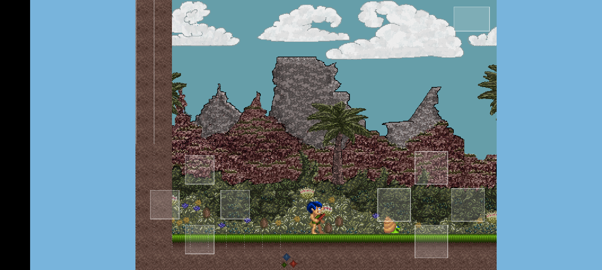

# Conan-the-Caveman-Android

A side-scrolling caveman platformer for Android, built on [**Storm Engine v2**](https://github.com/WillSams/storm-engine-v2).

Originally the example project from ['SDL Game Development'][2] by Shaun Mitchell, re-architected on the engine's `Game` + `GameStateMachine` + `AssetStore`. This repo is the Android port: the engine and game compile into a single JNI library via Gradle + CMake + NDK, SDL's `SDLActivity` hosts it, and on-screen touch controls (a d-pad and a four-button action cluster) drive the caveman. The desktop version lives in [Conan-the-Caveman-Linux](https://github.com/WillSams/Conan-the-Caveman-Linux).



## Requirements

- **Storm Engine v2 v1.2.0+**, vendored as the `external/storm-engine-v2` submodule (Android needs the engine compiled in, not an installed `.so`)
- Java 17, Android cmdline-tools, NDK, and CMake — see the engine's [`examples/android-platformer/README.md`](https://github.com/WillSams/storm-engine-v2/blob/main/examples/android-platformer/README.md) for the exact `sdkmanager` install commands
- A device with **USB debugging** enabled (or an emulator)

## Setup

```bash
git clone --recursive https://github.com/WillSams/Conan-the-Caveman-Android.git
cd Conan-the-Caveman-Android
# if you cloned without --recursive:
git submodule update --init --recursive
```

The recursive init pulls the engine and, under it, the pinned SDL2 / SDL_image / SDL_ttf / SDL_mixer / tinyxml2 / glm Android sources.

## Build, install, run

```bash
./gradlew assembleDebug     # app/build/outputs/apk/debug/app-debug.apk
./gradlew installDebug      # install onto the connected device
adb shell am start -n com.stormengine.conan/.ConanActivity
```

Or tap **Conan the Caveman** in the app drawer. The first build compiles SDL and FreeType from source, so it takes a while; later builds only recompile the game.

### Installing a prebuilt APK

Every push to `main` publishes a debug APK to the [latest release](../../releases/tag/latest); the CI **Android Build** run also attaches it as an artifact. Because debug builds are signed with a throwaway keystore that differs between your machine and CI (and between CI runs), Android will refuse to install one *over* a copy signed by a different key — the install silently fails even though Play Protect passes it. Uninstall any existing copy first:

```bash
adb uninstall com.stormengine.conan   # or long-press the icon -> Uninstall
adb install app-debug.apk
```

`adb install` (rather than tapping the file) prints the real reason on failure — `INSTALL_FAILED_UPDATE_INCOMPATIBLE` confirms the signature mismatch.

## Controls

On-screen, laid out for thumbs:

- **Left — d-pad**: a circular pad; left/right walk (up/down are wired for future use). Angle sectors mean diagonals register naturally.
- **Right — action diamond**: SNES-style **X / Y / A / B**. **A or B jumps.** X and Y are wired but unmapped in this game.
- **Pause**: the top-right zone, the Android **Back** button, or **Start** on a paired controller.

Bluetooth controllers and keyboards work too — the touch layer sits on top of the engine's existing gamepad/keyboard input.

## Tests

The game's pure logic — platformer physics, collider-map parsing, menu-button hit-testing, and controller-input helpers — is unit-tested with [igloo](https://github.com/joakimkarlsson/igloo):

```bash
make test       # builds and runs the desktop spec suite
```

## Layout

```text
external/storm-engine-v2   Engine submodule (pinned to v1.2.0) with its vendored Android SDL sources
include/stormengine2       Symlink to the engine's common/ so <stormengine2/...> includes resolve
app/                       Gradle module: build.gradle, jni/CMakeLists.txt, ConanActivity, AndroidManifest
src/                       Game code — states, physics, input (gamepad helper; touch pad comes from the engine)
data/                      Level (conan.map + colliders), screen XML, gfx, sfx — extracted to internal storage at launch
specs/                     igloo specs for the pure logic
```

[2]: https://www.packtpub.com/game-development/sdl-game-development
